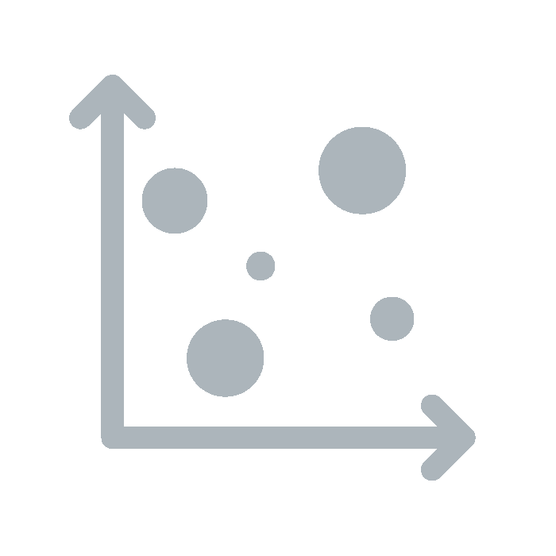

  

  	

  	 	  	

  					<h1>First and Second Cities</h1>
  				

  	

    

      

        
Select first city

      

      

        

      

    

  

<!-- DATA -->

	

    

      <!-- LH -->
      

      <input id="filter" class="form-control" placeholder="Filter list...">
      

    

    

      

        <h2>Getting started</h2>

        

          

            
            

              
Select a city from the list

            

          

          

            
            

              
See the next city where this composer was performed

            

          

          

            
            

              
See a list of all performances

            

          

        

        <h3>Learn more</h3>
        
 watch this video tutorial...

<!--
        

          
          
          
        

        
Select a composer from the list on the left

        <ul>
          <li>see where they were performed</li>
          <li>see a list of all their performances</li>
          <li>optionally select a range of years from the <i>Total performances</i> graph to filter</li>
        </ul>
        
Then select another composer to explore the data further...

-->

      
 <!-- /info -->

      

        <!-- removed chart-composite-composers
        

 -->

        <h2 id="this-city"></h2>

        <h3>Next city </h3>
        

        
Total first performances per year

        

        <!--<h3>Datatable</h3>-->
        <table id="table-datasummary" class="table data-table "></table>

        

          Showing - of  
          <input id="last" class="btn" type="Button" value="Previous" onclick="javascript:last()" />
          <input id="next" class="btn" type="button" value="Next" onclick="javascript:next()"/>

          <button type="button" class="btn btn-secondary" id="download">Download this list <i class="fa fa-download" aria-hidden="true"></i></button>
        

      
 <!-- /graphs -->

    

  

