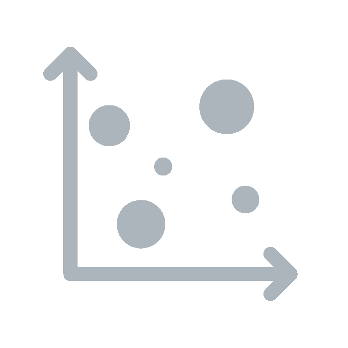
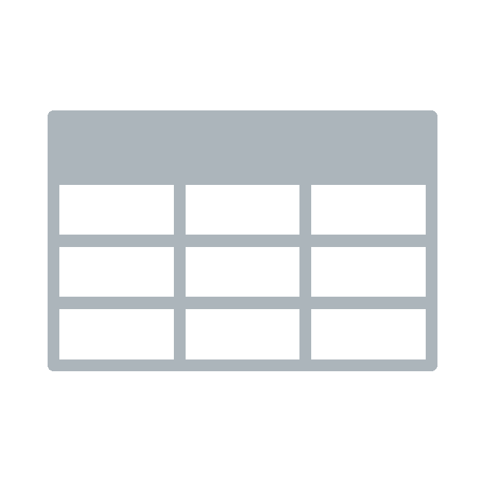

  

  	

  	 	  	

  					<h1>Places</h1>
  				

  	

    

      

        
Select two places

      

      

        

      

    

  

<!-- DATA -->

  

    

      <!-- LH -->
      

      <input id="filter" class="form-control" placeholder="Filter list...">
      

    

    

      <!-- RH -->
      

        <h2>Getting started</h2>

        

          

            
            

              
Select two places from the list

            

          

          

            
            

              
See which composers were performed

            

          

          

            
            

              
See a list of all performances

            

          

        

        <h3>Learn more</h3>
        
 watch this video tutorial...

      
 <!-- /info -->

      

        

          

            <h3>Composers</h3>
            

            

          

          

            <!-- MAIN -->
            <h3>Performances per city</h3>
            

            
Total performances

            

            <table id="table-datasummary" class="table data-table "></table>

            

              Showing - of  
              <input id="last" class="btn" type="Button" value="Previous" onclick="javascript:last()" />
              <input id="next" class="btn" type="button" value="Next" onclick="javascript:next()"/>

              <button type="button" class="btn btn-secondary" id="download">Download this list <i class="fa fa-download" aria-hidden="true"></i></button>
            

      
 <!-- /graphs -->

    

  

